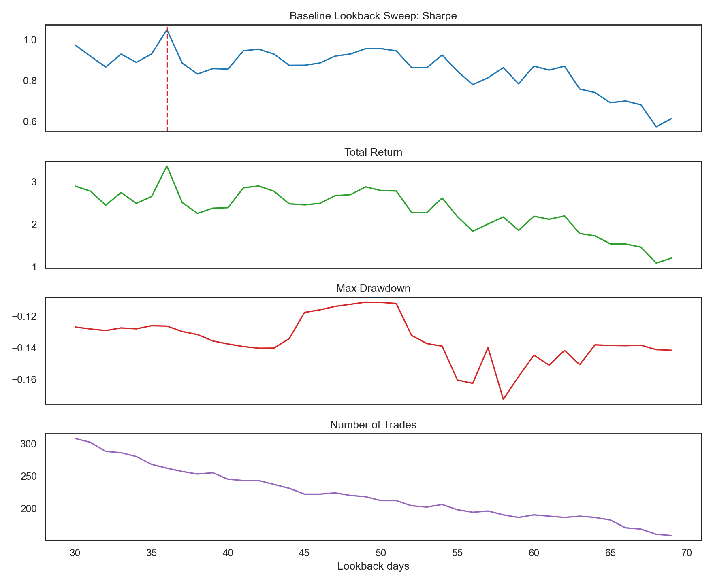
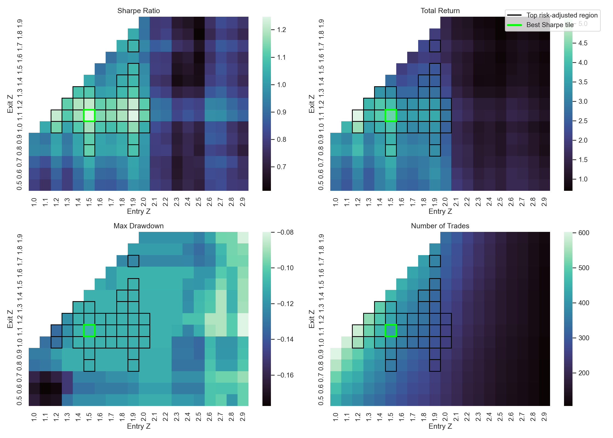
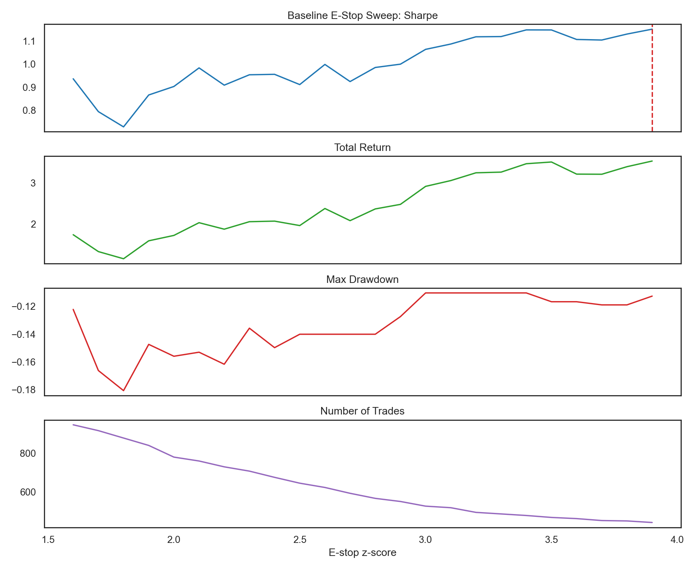
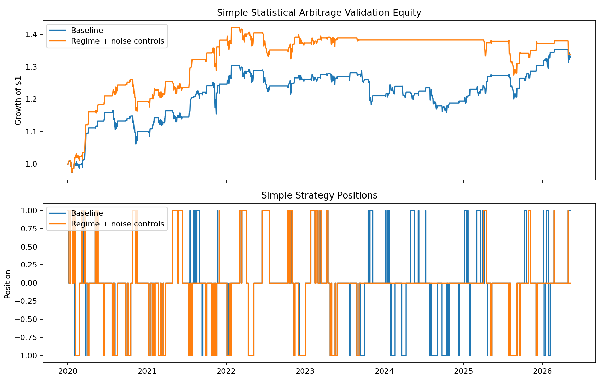

# DGQT Statistical Arbitrage Research

This project studies a pairs trading strategy between Visa (`V`) and Mastercard (`MA`). The central idea is that both companies operate in the same payments ecosystem, so their log prices often move together. When the relationship temporarily stretches, the strategy attempts to trade the spread back toward its estimated mean.

The final research direction uses an Ornstein-Uhlenbeck (OU) process on the hedged log-price spread:

```text
spread = log(MA) - beta * log(V)
```

`beta` is estimated with a rolling regression of `log(MA)` on `log(V)`. This creates a hedge-adjusted spread rather than a simple price difference. A positive position means long `MA` and short beta-adjusted `V`; a negative position means short `MA` and long beta-adjusted `V`.


## OU Validation

The main research notebook is [`ou_validation.ipynb`](ou_validation.ipynb). It extends the earlier statistical arbitrage work by replacing the simple rolling z-score model with an explicit OU/AR(1) estimate of mean reversion. For each trading day, the notebook takes a trailing spread window and fits:

```text
X[t+1] = intercept + phi * X[t] + error
```

For a stationary mean-reverting process, `0 < phi < 1`. The notebook converts this fitted AR(1) form into OU-style parameters:

```text
theta = -log(phi)
mu = intercept / (1 - phi)
half_life = log(2) / theta
```

The current spread is then scored as:

```text
ou_z = (current_spread - ou_mu) / ou_sigma
```

This matters because the strategy is no longer assuming that every large rolling deviation is equally tradable. It checks whether the spread still looks mean reverting, how quickly it is expected to decay, and whether its estimated stationary volatility is reasonable.

The current OU configuration uses a 252-day hedge lookback, a 378-day OU lookback, entry threshold of `1.0`, exit threshold of `0.75`, emergency stop of `3.9`, and half-life bounds from 1 to 60 trading days. A high positive `ou_z` triggers a short-spread trade: short `MA`, long `V`. A low negative `ou_z` triggers a long-spread trade: long `MA`, short `V`. Positions exit when the spread mean-reverts, hits the emergency stop, or fails the regime checks.

The notebook also calibrates regime filters using only pre-2020 data. These filters require high enough return correlation, stable rolling beta, acceptable OU volatility, and a reasonable half-life. This separation is important: thresholds are learned before the validation period, then tested from 2020 onward.

On the current local CSV data, the OU training period runs from March 19, 2008 through December 31, 2019. It produces a Sharpe ratio of about `1.03`, total return of about `46.1%`, maximum drawdown of about `-4.8%`, and 64 position changes. The validation period runs from January 2, 2020 through May 11, 2026. It produces a Sharpe ratio of about `1.52`, total return of about `88.8%`, maximum drawdown of about `-5.5%`, and 78 position changes.


These results are encouraging, but they are still backtest results. They do not fully model slippage, commissions, short borrow availability, tax effects, partial fills, or live order-book behavior.

## Earlier Baseline

Before the OU version, the project tested a simpler statistical arbitrage algorithm in [`basic_iteration/hyperparameter_tuning.ipynb`](basic_iteration/hyperparameter_tuning.ipynb). That model used a rolling hedge ratio, a rolling spread mean, and a rolling spread standard deviation. It entered when the ordinary z-score crossed an entry threshold and exited when it crossed back toward zero.

The baseline was heavily tuned. The notebook swept lookback windows, entry thresholds, exit thresholds, and an emergency stop. The best lookback sweep in the 30-69 day region reached an in-sample Sharpe of about `1.05`. The best entry/exit threshold tile reached an in-sample Sharpe of about `1.25`, with `entry_z = 1.5` and `exit_z = 1.1`. The e-stop sweep peaked around `1.15`.



The seaborn heatmaps below show why this was not fully satisfying. The profitable regions were present, but performance depended heavily on the chosen thresholds. The best tile was not enough evidence that the simple model was robust.





After validation, the simple strategy was not excellent. The tuned baseline reached only about `0.58` Sharpe from 2020 onward, with about `33.0%` total return, `-11.2%` maximum drawdown, and 214 position changes. Adding regime and noise controls improved it only modestly to about `0.66` Sharpe, with about `33.8%` total return and `-10.3%` maximum drawdown.



This is the main reason the project moved toward the OU process. The OU version gives the spread model a more explicit mean-reversion structure, adds half-life awareness, and uses OU stationary volatility rather than only a rolling sample standard deviation.

## Manual Trading Notebook

[`manual_trading_sim.ipynb`](manual_trading_sim.ipynb) connects the research logic to Alpaca paper trading in a controlled notebook format. It loads the same OU parameters, connects with `TradingClient`, requests daily Alpaca bars using the free/basic IEX feed, computes the latest signal, and builds an `order_plan_df`.

Before submitting anything, the notebook shows the current shares, target shares, trade quantity, latest price, and trade notional for both symbols. With `PAPER = True`, any submitted order goes to Alpaca paper trading rather than live capital. This notebook is useful for inspecting one complete trading decision by hand.

## Bot Entrypoint

The deployable script version lives in [`Algorithmic trading/`](Algorithmic%20trading/). Run only:

```bash
.venv/bin/python "Algorithmic trading/bot.py"
```

For a preview without submitting paper orders:

```bash
SUBMIT_ORDERS=false .venv/bin/python "Algorithmic trading/bot.py"
```

The best workflow is: research changes in `ou_validation.ipynb`, inspect live behavior in `manual_trading_sim.ipynb`, then schedule `bot.py` after the order plan looks correct.
