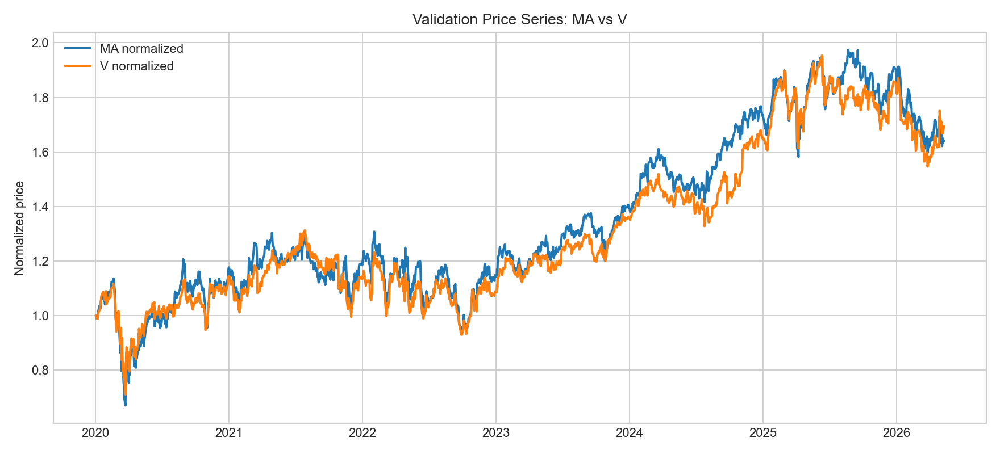
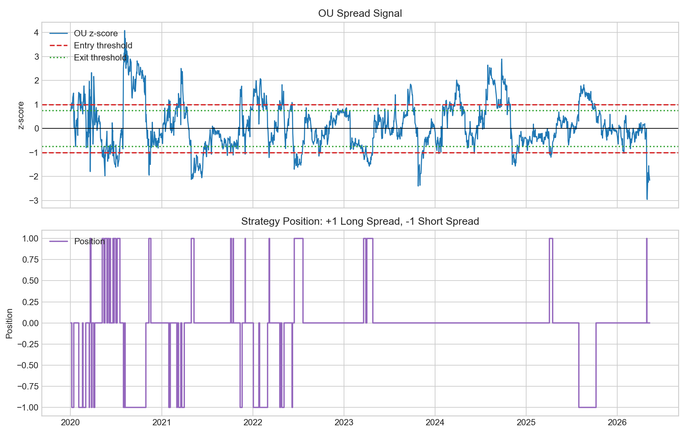
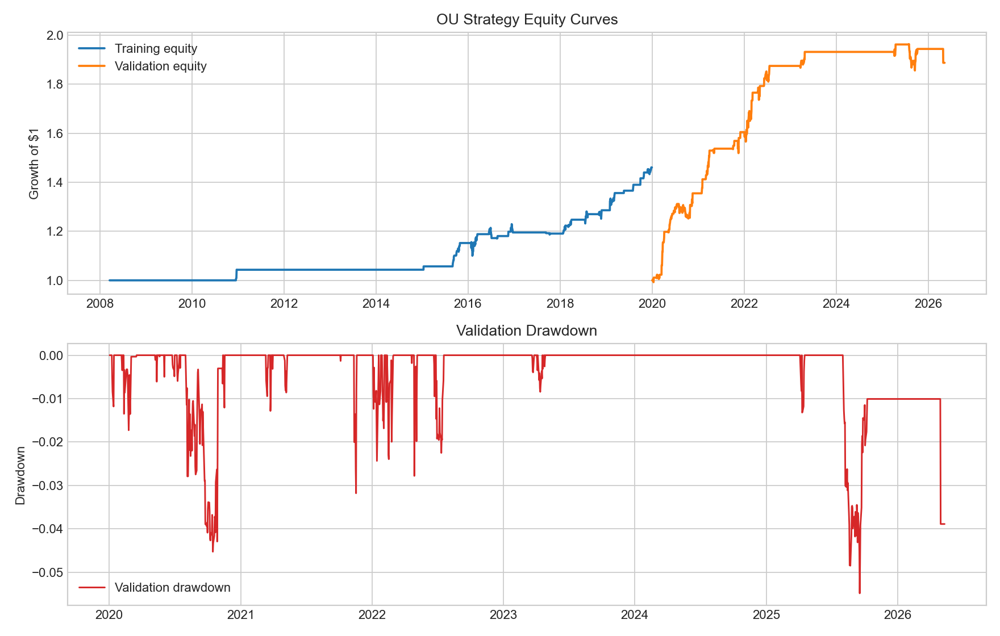
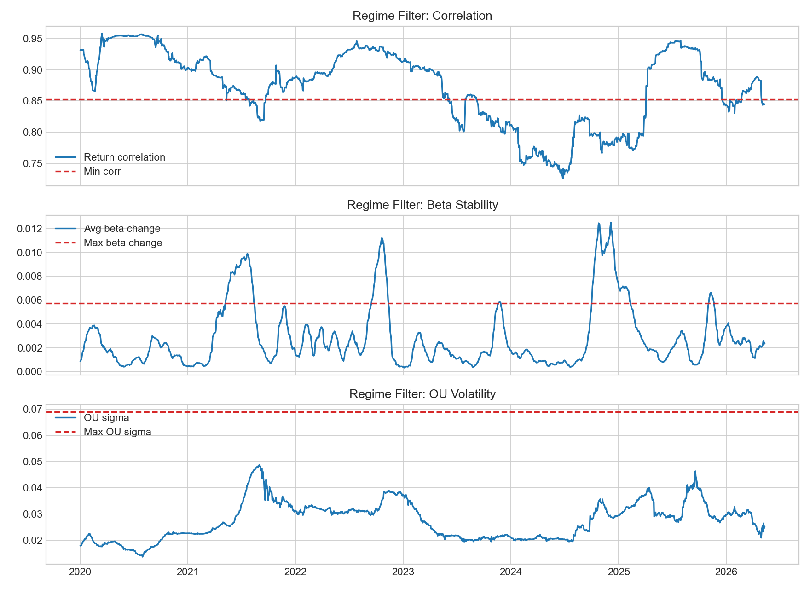

# DGQT Statistical Arbitrage Bot

This project develops a statistical arbitrage strategy for Visa (`V`) and Mastercard (`MA`), validates it in notebooks, and converts the same logic into a paper-trading Alpaca bot. The core hypothesis is that the two payment networks have a stable long-term relationship, so temporary deviations in their log-price spread can be traded as a mean-reverting pair.

The deployed strategy models the spread as:

```text
spread = log(MA) - beta * log(V)
```

`beta` is estimated on a rolling hedge window, and the spread is then fit to a discrete Ornstein-Uhlenbeck / AR(1) process. The bot uses the OU mean and stationary volatility to calculate a z-score. A positive z-score means the spread is high relative to its estimated mean; a negative z-score means it is low.



## OU Validation

The main research notebook is [`ou_validation.ipynb`](ou_validation.ipynb). It loads historical daily CSV data from `V_daily.csv` and `MA_daily.csv`, computes returns and log prices, and applies the OU strategy with the same parameters now used by the bot. The current configuration uses a 252-day hedge lookback, a 378-day OU lookback, entry threshold of `1.0`, exit threshold of `0.75`, emergency stop of `3.9`, and a half-life filter between 1 and 60 trading days.

The notebook splits the work into a pre-2020 training/calibration section and a 2020 onward validation section. Regime thresholds are calibrated only on pre-2020 data. This matters because the validation period is meant to test whether the rules still work after the thresholds have already been chosen. The filters require sufficiently high return correlation, stable rolling beta, reasonable OU volatility, and acceptable mean-reversion half-life.

On the current local CSV data, the training period runs from March 19, 2008 through December 31, 2019. It produces a Sharpe ratio of about `1.03`, total return of about `46.1%`, maximum drawdown of about `-4.8%`, and 64 position changes. The validation period runs from January 2, 2020 through May 11, 2026. It produces a Sharpe ratio of about `1.52`, total return of about `88.8%`, maximum drawdown of about `-5.5%`, and 78 position changes.

These numbers come from the research backtest and do not prove live profitability. The notebook does not model every real execution cost, borrow constraint, short-sale issue, fill quality problem, or tax effect. It is best read as a strategy validation tool, not as a guarantee.



## Manual Trading Notebook

[`manual_trading_sim.ipynb`](manual_trading_sim.ipynb) bridges the research notebook and actual Alpaca paper execution. It uses the same OU parameters from `ou_validation.ipynb`, connects to Alpaca with `TradingClient`, downloads recent daily bars with `StockHistoricalDataClient`, and explicitly requests the free/basic IEX market data feed:

```python
feed=DataFeed.IEX
```

The notebook is intentionally manual. It prints the Alpaca account status, computes the latest signal, builds an `order_plan_df`, and then submits market orders only if `SUBMIT_ORDERS = True`. With `PAPER = True`, those orders go to Alpaca paper trading, not live capital. Before executing the order cell, inspect `order_plan_df`; it shows the current position, target quantity, trade quantity, latest price, and trade notional for both `MA` and `V`.

This notebook is useful for development because every step is visible. It is not a continuously running bot. It only trades when you run the cells.



## Bot Deployment

The deployable version lives in [`Algorithmic trading/`](Algorithmic%20trading/). Run only the entrypoint:

```bash
.venv/bin/python "Algorithmic trading/bot.py"
```

`bot.py` imports the other modules automatically:

- `config.py` stores symbols, OU thresholds, filters, exposure, and paper-trading settings.
- `data.py` loads Alpaca daily bars using `DataFeed.IEX`.
- `strategy.py` implements the OU feature calculation and signal logic from `ou_validation.ipynb`.
- `execution.py` loads credentials, checks current Alpaca positions, builds the target order plan, and submits market orders.

The bot requires Alpaca API keys. The recommended deployment method is environment variables:

```bash
export ALPACA_API_KEY="your_key"
export ALPACA_SECRET_KEY="your_secret"
export ALPACA_PAPER=true
```

It can also fall back to the project-level `alpaca_keys.py` file. The bot is designed for paper trading and prints the paper endpoint:

```text
https://paper-api.alpaca.markets/v2
```

By default, `SUBMIT_ORDERS` is true. For a safe preview, run:

```bash
SUBMIT_ORDERS=false .venv/bin/python "Algorithmic trading/bot.py"
```

That command computes the latest signal and order plan without placing paper orders. After reviewing the output, run the normal command to submit paper trades.

Because the strategy uses daily bars, it should usually be scheduled once per trading day rather than run in a tight loop. A local cron example for weekdays near the close is:

```cron
50 14 * * 1-5 cd /Users/dhimanroy/Projects/PythonProject/DGQT_algo && ALPACA_PAPER=true SUBMIT_ORDERS=true .venv/bin/python "Algorithmic trading/bot.py" >> "Algorithmic trading/bot.log" 2>&1
```

The best workflow is: research changes in `ou_validation.ipynb`, inspect live behavior in `manual_trading_sim.ipynb`, then schedule `bot.py` after the order plan looks correct.


