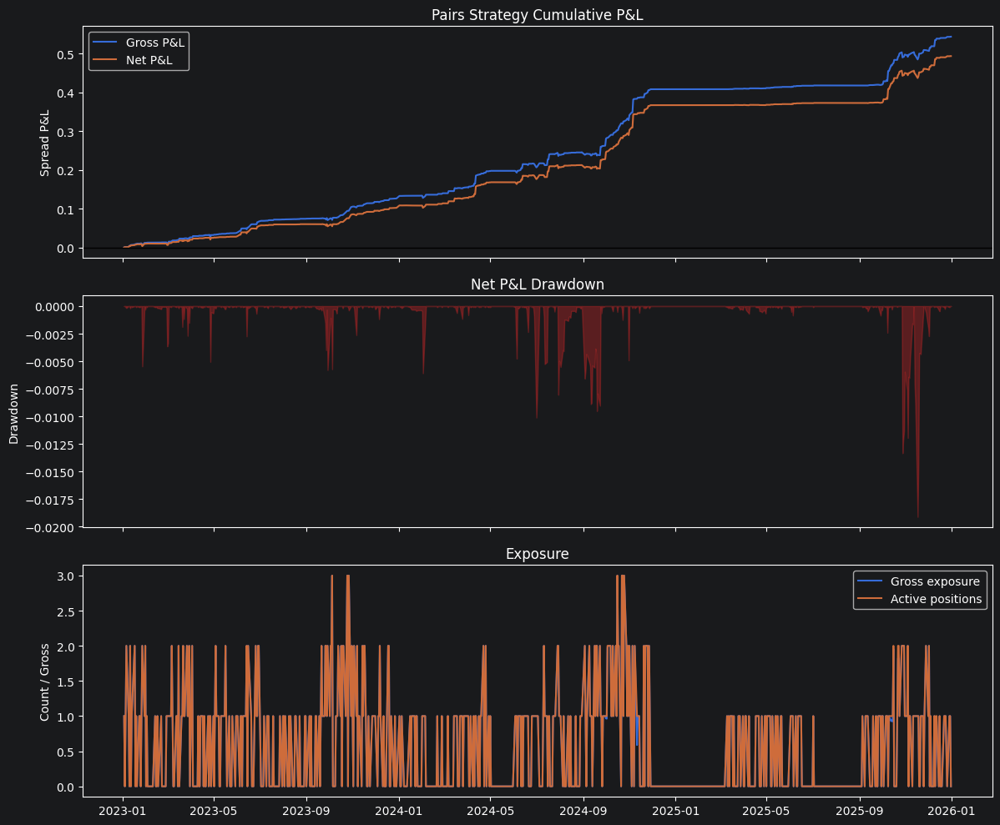

# DGQT Statistical Arbitrage Research

This repository researches a systematic pairs-trading strategy for liquid equity and ETF pairs. The current implementation separates the workflow into two layers:

- `Tuner` in `tuning.py`: monthly research and parameter selection.
- `PairsTradingStrategy` in `strategy.py`: daily signal generation, regime checks, sizing, and risk controls.

The main idea is simple: some related securities often move together because they share common economic drivers. Examples include `V/MA`, `XOM/CVX`, `JPM/BAC`, `GOOG/GOOGL`, `SPY/IVV`, and `GLD/IAU`. When the relationship temporarily stretches, the strategy attempts to trade the spread back toward its estimated equilibrium.

The important caveat is that cointegration is not treated as a permanent trait. A pair can look cointegrated in one market regime and fail in another. A stable relationship from 2015 to 2018 does not imply the same relationship survived 2020, 2022, or 2025. For that reason the strategy does not select pairs once and assume they are valid forever. It retunes and reselects active pairs every month using a trailing historical window, and it also checks daily whether each active pair still passes regime filters.

## Repository Layout

`tuning.py`

Defines the `Tuner` class. This class owns the monthly workflow:

- tune Kalman filter process/measurement noise parameters, `q_alpha`, `q_beta`, and `r`
- tune z-score lookback
- tune entry and exit z-score thresholds
- tune a whole universe of candidate pairs with `Tuner.tune_universe(...)`
- return the active pairs and tuned parameter table used by the live daily strategy

`strategy.py`

Defines the `PairsTradingStrategy` class. This class owns the daily workflow:

- update the Kalman hedge ratio
- update the spread and z-score
- check cointegration and mean-reversion regime filters
- generate a target long/short/flat signal
- size the signal by spread volatility
- apply pair-level and portfolio-level risk limits
- estimate transaction costs

`backtest.ipynb`

Runs the full strategy from the start of 2023 through the end of 2025. It retunes monthly, trades daily, computes gross and net P&L, applies transaction costs, calculates risk-free-rate-adjusted Sharpe ratios, and produces portfolio and pair-level diagnostics.

`primary_research.ipynb`

Research notebook for screening pairs, checking cointegration, checking mean reversion, and experimenting with Kalman-spread behavior.

`downloader.ipynb`

Data download notebook for updating the CSV files in `Data/`.

`Data/`

Daily adjusted-close CSV files used by the research and backtests.

## Strategy Intuition

The strategy models a pair as two log-price series:

```text
y = log(price of first asset)
x = log(price of second asset)
spread = y - alpha - beta * x
```

If the spread is stationary and mean reverting, then unusually high or low spread values may represent temporary dislocations. A positive spread means `y` is high relative to `x`; a negative spread means `y` is low relative to `x`.

The trading logic is:

- if z-score is high, short the spread
- if z-score is low, long the spread
- exit when the z-score reverts toward zero
- stay flat when the pair fails regime checks

The strategy uses log prices rather than raw prices because log-price differences map more naturally to relative moves.

## Why Cointegration Is Treated As Temporary

Cointegration tests ask whether a linear combination of two non-stationary price series is stationary over a chosen sample. The phrase "over a chosen sample" matters. A pair can pass the test from 2015 to 2018 and fail from 2010 to 2018 because the longer period may include a different market regime, changed business fundamentals, changes in index construction, different volatility conditions, or structural breaks.

That does not mean train/validation/test splitting is wrong. It means the strategy must be honest about time variation. The current design handles this in two ways:

- monthly selection uses only trailing data available before the rebalance date
- daily regime filters can force a tuned pair flat if its relationship no longer looks tradable

This is the core research assumption of the repository: statistical relationships are candidates, not facts.

## Why A Kalman Filter Is Used

A static hedge ratio assumes the relationship between the two assets is constant:

```text
y = alpha + beta * x + residual
```

That is usually too rigid for equities. Sector exposures, balance sheets, macro sensitivity, index flows, and idiosyncratic news all change over time. The Kalman filter gives the hedge relationship a controlled way to drift.

The state is:

```text
theta = [alpha, beta]
```

Each day, the filter predicts the current relationship, observes the latest pair prices, and updates `alpha` and `beta`. The tuning parameters control how flexible the filter is:

- `q_alpha`: how quickly the intercept can move
- `q_beta`: how quickly the hedge ratio can move
- `r`: how noisy the observation is assumed to be

If `q_alpha` and `q_beta` are too small, the filter is too slow and the spread can become stale. If they are too large, the filter adapts too aggressively and may explain away the dislocation that the strategy is trying to trade. That is why these parameters are tuned monthly.

## Monthly Workflow

The monthly process is handled by `Tuner`.

For each candidate pair, the tuner:

1. Builds a trailing training window ending before the rebalance date.
2. Tests each Kalman parameter set.
3. Selects the Kalman parameters with the best filtered Sharpe/P&L behavior.
4. Tunes the rolling z-score lookback.
5. Tunes entry and exit z-score thresholds.
6. Stores the tuned parameters and backtest diagnostics.

At the universe level, `Tuner.tune_universe(...)` loops over all candidate pairs, tunes each one, filters weak candidates, and returns:

```python
{
    "active_pairs": ...,
    "tuned_params": ...,
    "all_tuned_params": ...,
    "tuners": ...,
    "failures": ...,
}
```

Those active pairs and tuned parameters are then passed into `PairsTradingStrategy`.

## Daily Workflow

The daily process is handled by `PairsTradingStrategy`.

Each trading day:

1. The Kalman state is advanced through the current date.
2. The current spread and z-score are calculated.
3. The pair is checked with a trailing cointegration gate.
4. If cointegration passes, the residual is checked for mean reversion and half-life.
5. A raw long/short/flat signal is generated from the z-score.
6. The signal is scaled by spread volatility.
7. Pair-level and portfolio-level exposure limits are applied.
8. Transaction costs are estimated from turnover.

The daily regime filters are intentionally conservative. A pair can be selected during monthly tuning but still sit flat on a particular day if the current trailing window does not pass the regime tests.

## Backtest Configuration

The main backtest lives in `backtest.ipynb` and currently uses:

- backtest period: `2023-01-01` through `2025-12-31`
- monthly retuning on the first trading day of each month
- trailing tuning window: `252` calendar days
- max active pairs: `5`
- minimum tuning Sharpe filter: `0.0`
- minimum tuning entries filter: `5`
- daily regime lookback: `252` observations
- cointegration p-value threshold: `0.10`
- mean-reversion half-life bounds: `2` to `63` trading days
- target spread volatility: `0.01`
- max pair position: `1.0`
- max gross exposure: `4.0`
- transaction cost assumption: `1` basis point per unit of turnover
- annual risk-free rate assumption for Sharpe: `4.0%`
- daily risk-free rate: `(1 + 0.04) ** (1 / 252) - 1`
- normalized capital base for return calculation: `1.0`

The Sharpe ratio in the notebook is calculated from daily excess returns:

```text
daily_return = daily_pnl / capital_base
daily_excess_return = daily_return - daily_risk_free_rate
sharpe = sqrt(252) * mean(daily_excess_return) / std(daily_return)
```

This makes the risk-free adjustment explicit. The P&L is still normalized spread P&L, not broker-account dollar P&L. A production system would need a more exact capital model, margin model, borrow model, financing model, and execution model.

## How To Run

Open and run `backtest.ipynb` from top to bottom.

For script usage, the important import shape is:

```python
from tuning import Tuner
from strategy import PairsTradingStrategy

monthly = Tuner.tune_universe(
    pair_data=pair_data,
    end_date="2022-12-31",
    trailing_window_days=252,
    max_pairs=5,
)

strategy = PairsTradingStrategy(
    pair_data=pair_data,
    tuned_params=monthly["tuned_params"],
    active_pairs=monthly["active_pairs"],
)

daily_decisions = strategy.run_day("2023-01-03")
```

The notebook version retunes automatically at each monthly rebalance date and accumulates the daily decisions into a portfolio-level backtest.

## Current Backtest Conclusion

The current 2023-2025 backtest is directionally encouraging but not production-ready.

Using the current notebook settings, the backtest runs from January 3, 2023 through December 31, 2025 and produces:

- total normalized gross spread P&L: `0.543799`
- transaction costs: `0.050106`
- total normalized net spread P&L: `0.493693`
- annualized net return on the normalized capital base: `16.5440%`
- annualized net excess return after the 4% risk-free-rate assumption: `12.6216%`
- gross excess Sharpe: `2.9992`
- net excess Sharpe: `2.6653`
- maximum drawdown: `-0.019116`
- average gross exposure: `0.5948`
- average active positions: `0.5971`
- average regime pass rate: `24.57%`



The strongest contributor was `JPM/BAC`, which produced about `0.215787` net spread P&L after costs. Other positive contributors were `V/MA`, `PEP/KO`, `XOM/CVX`, `GOOG/GOOGL`, and `AGG/BND`. `GLD/IAU` and `SPY/IVV` were selected at times but did not materially contribute in the observed run. Several pairs spent many days flat because the daily regime filters failed. This is expected and supports the core design choice: pair validity is time-varying, and the strategy should not force trades when the relationship is not currently strong.

Pair-level net spread P&L from the saved notebook output:

| Pair | Net P&L | Active days | Regime pass rate |
| --- | ---: | ---: | ---: |
| `JPM/BAC` | `0.215787` | `71` | `40.06%` |
| `V/MA` | `0.118445` | `97` | `33.91%` |
| `PEP/KO` | `0.077080` | `35` | `19.28%` |
| `XOM/CVX` | `0.041019` | `26` | `31.62%` |
| `GOOG/GOOGL` | `0.039392` | `180` | `62.93%` |
| `AGG/BND` | `0.001969` | `40` | `15.17%` |
| `GLD/IAU` | `0.000000` | `0` | `0.18%` |
| `SPY/IVV` | `0.000000` | `0` | `0.00%` |

The result should be interpreted cautiously. The backtest uses simplified normalized spread P&L, a simple 1 bp turnover cost model, and a fixed 4% annual risk-free-rate assumption for excess Sharpe. It does not yet model slippage, bid/ask spreads, borrow costs, margin requirements, financing rates, corporate actions beyond adjusted closes, taxes, partial fills, or intraday execution quality.

The main conclusion is that the framework is viable as a research architecture: monthly tuning plus daily regime-aware execution is a better design than selecting a pair once and assuming it remains valid forever. The positive 2023-2025 net excess Sharpe suggests the idea is worth further research, but the next step is not to declare the strategy finished. The next step is to harden the backtest with realistic capital accounting, execution assumptions, broader out-of-sample validation, and cached monthly tuning so repeated experiments run faster.
